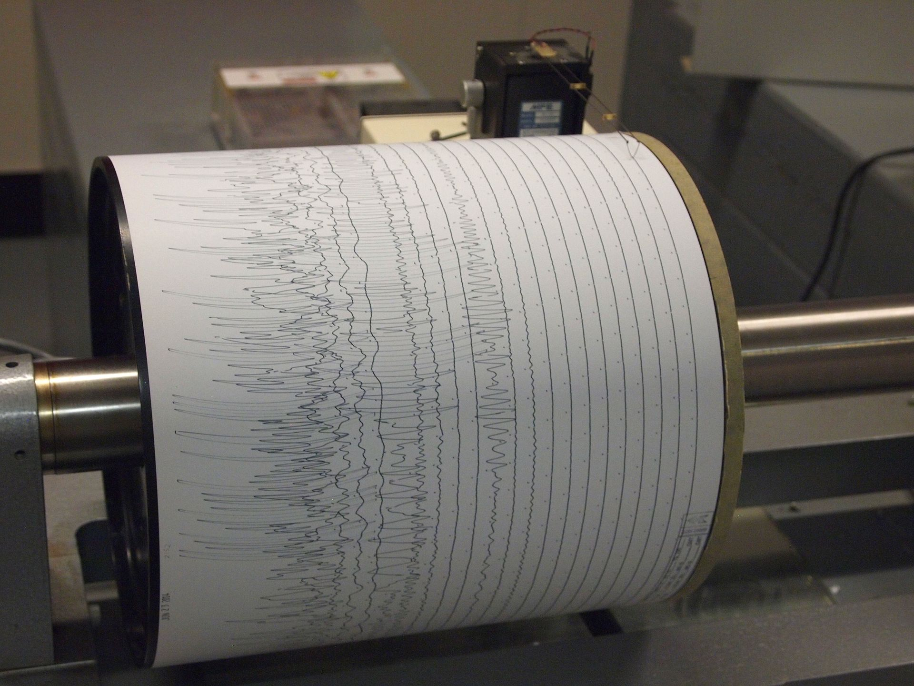
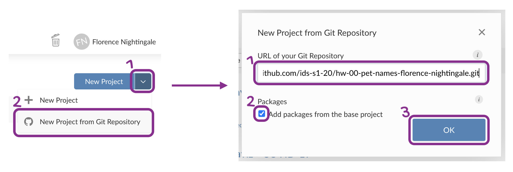
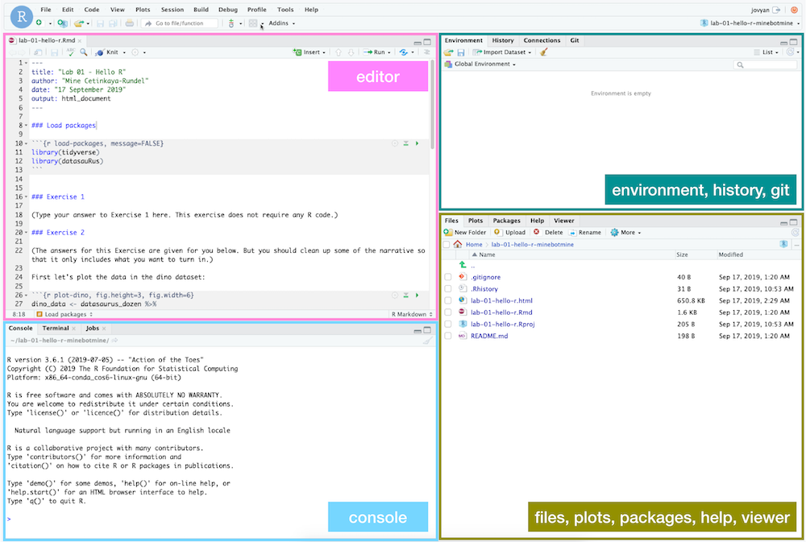

```{r include = FALSE}
knitr::opts_chunk$set(
  eval = FALSE,
  out.width = "80%",
  fig.asp = 0.618,
  fig.width = 10
)
library(tidyverse)
library(openintro)
library(ggrepel)
```

```{r photo, fig.margin = TRUE, echo = FALSE, fig.width = 5, fig.cap = "Seismogram being recorded at Weston Observatory, MA (Wikipedia)", eval = TRUE}

```

The goal of this assignment is to introduce you to R, RStudio, Git, and GitHub, which you'll be using throughout the course both to learn the data science concepts discussed in the course and to analyze real data and come to informed conclusions.

# Getting started

## Terminology

We've already thrown around a few new terms, so let's define them before we proceed.

-   **R:** Name of the programming language we will be using throughout the course.

-   **RStudio:** An integrated development environment for R.
    In other words, a convenient interface for writing and running R code.

-   **Git:** A version control system.

-   **GitHub:** A web platform for hosting version controlled files and facilitating collaboration among users.

-   **Repository:** A Git repository contains all of your project's files and stores each file's revision history.
    It's common to refer to a repository as a repo.

    -   In this course, each assignment you work on will be contained in a Git repo.
    -   For individual assignments, only you will have access to the repo. For team assignments, all team members will have access to a single repo where they work collaboratively.
    -   All repos associated with this course are housed in the course GitHub organization. The organization is set up such that students can only see repos they have access to, but the course staff can see all of them.

## Starting slow

As the course progresses, you are encouraged to explore beyond what the assignments dictate; a willingness to experiment will make you a much better programmer!
Before we get to that stage, however, you need to build some basic fluency in R.
First, we will explore the fundamental building blocks of all of these tools.

Before you can get started with the analysis, you need to make sure you:

-   have a GitHub account

-   are a member of the course GitHub organization

-   are a member of the course RStudio Cloud space

If you failed to confirm any of these, it means you have not yet completed the prerequisites for this assignment.
Please go back to [Prerequisites] and complete them before continuing the assignment.

# Workflow

For the coursework each week (exercises, lab, and homework) you will start with a GitHub repo that I created for you which contains all the files you will need.
**I will share the link to your weekly repo on the Weekly Content blackboard page, on Monday before class**.
You will generate your own private repo from the template called: *week-X-yourlastname*.
This week during class you cloned (copied) this repo into RStudioCloud and worked on the exercises and lab.
For this homework, you will build upon the *hw-01-earthquakes-starter* Rmd file for your homework assignment.

The first step is always to bring these files into RStudio so that you can edit them, run them, view your results, and interpret them.
Since you already are looking at this homework 1 RMarkdown file, you have already accomplished all of this!
However let's recap these steps because being able to do this is part of the first week's lesson!

First we need to copy the GItHub repo to RStudioCloud: This action is called **cloning**.

Then you work in RStudio on the data analysis, making **commits** along the way (snapshots of your changes) and finally **push** all your work back to GitHub.

The next few steps will remind you of the process of getting information of the repo to be cloned, cloning your repo in a new RStudio Cloud project, and getting started with the analysis.

### Step 1. Get URL of repo to be cloned

```{r clone-repo-link, fig.margin = TRUE, echo = FALSE, eval = TRUE}
knitr::include_graphics("img/clone-repo-link.png")
```

On GitHub, click on the green **Code** button, select **HTTPS** (this might already be selected by default, and if it is, you'll see the text *Use Git or checkout with SVN using the web URL* jas in the image on the right).
Click on the clipboard icon 📋 to copy the repo URL.

### Step 2. Go to RStudio Cloud

Go to [rstudio.cloud](https://rstudio.cloud/ "RStudio Cloud") and then **navigate to the course workspace** via the left sidebar.
It's very important that you do this for two reasons:

-   It's only when you're in the course workspace that you'll be able to benefit from R packages I've pre-installed for you so that your project can be configured correctly.
-   It's only when you're in the course workspace that your usage of RStudio Cloud won't count towards the free usage limits.

```{r course-workspace, fig.margin = TRUE, echo = FALSE, eval = TRUE}
knitr::include_graphics("img/course-workspace.png")
```

Before you proceed, confirm that you are in the course workspace by checking out what's on your top bar in RStudio Cloud.

### Step 3. Clone the repo

In RStudio, click on the **down arrow** next to New Project and then choose **New Project from Git Repository**.

In the pop-up window, **paste the URL** you copied from GitHub, make sure the box for **Add packages from the base project** is checked (it should be, by default) and then click **OK**.

```{r new-project-from-git, echo = FALSE, eval = TRUE, fig.align = "left"}

```

# Hello RStudio!

Let's remind ourselves of the RStudio working environment.

RStudio is comprised of four panes.

```{r rstudio-anatomy, fig.fullwidth=TRUE, echo = FALSE, eval = TRUE}

```

-   On the bottom left is the Console, this is where you can write code that will be evaluated. Try typing `2 + 2` here and hit enter, what do you get?
-   On the bottom right is the Files pane, as well as other panes that will come handy as we start our analysis.
-   If you click on a file, it will open in the editor, on the top left pane.
-   Finally, the top right pane shows your Environment. If you define a variable it would show up there. Try typing `x <- 2` in the Console and hit enter, what do you get in the **Environment** pane? Importantly, this pane is also where the **Git** interface lives. We will be using that regularly throughout this assignment.

# Warm up

Before we introduce the data, let's warm up with some simple exercises.

```{marginfigure}
The top portion of your R Markdown file (between the three dashed lines) is called **YAML**. It stands for "YAML Ain't Markup Language". It is a human friendly data serialization standard for all programming languages. All you need to know is that this area is called the YAML (we will refer to it as such) and that it contains meta information about your document.
```

## Step 1. Update the YAML

Open the R Markdown (Rmd) starter file in your week-1 materials, and change the author name to your name, and knit the document.

```{r yaml-raw-to-rendered, echo = FALSE, eval = TRUE, fig.align = "center"}
knitr::include_graphics("img/yaml-raw-to-rendered.png")
```

## Step 2: Commit

Then Go to the **Git pane** in your RStudio.

You should see that your Rmd (R Markdown) file and its output, your md file (Markdown), file are listed there as recently changed files.

Next, click on **Diff**.
This will pop open a new window that shows you the **diff**erence between the last committed state of the document and its current state that includes your changes.
If you're happy with these changes, click on the checkboxes of all files in the list, and type *"Update author name"* in the **Commit message** box and hit **Commit**.

```{r update-author-name-commit, echo = FALSE, eval = TRUE, fig.align = "left"}
knitr::include_graphics("img/update-author-name-commit.png")
```

You don't have to commit after every change, this would get quite cumbersome.
You should consider committing states that are *meaningful to you* for inspection, comparison, or restoration.
In the first few assignments we will tell you exactly when to commit and in some cases, what commit message to use.
As the semester progresses we will let you make these decisions.

## Step 3. Push

Now that you have made an update and committed this change, it's time to push these changes to the web!
Or more specifically, to your repo on GitHub.
Why?
So that others can see your changes.
And by others, we mean the course teaching team (your repos in this course are private to you and us, only).
In order to push your changes to GitHub, click on **Push**.

```{r ready-to-push, fig.margin = TRUE, echo = FALSE, eval = TRUE}
knitr::include_graphics("img/ready-to-push.png")
```

This will prompt a dialogue box where you first need to enter your user name, and then your password.
This might feel cumbersome.
Bear with me... I *will* teach you how to save your password so you don't have to enter it every time.
But for this one assignment you'll have to manually enter each time you push in order to gain some experience with it.

**Thought exercise:** Which of the above steps (updating the YAML, committing, and pushing) needs to talk to GitHub?[^1]

# Packages

R is an open-source language, and developers contribute functionality to R via packages.
In this assignment we will use the following packages:

-   **tidyverse**: a collection of packages for doing data analysis in a "tidy" way
-   **openintro**: a package that contains the datasets from OpenIntro resources

We use the `library()` function to load packages.
In your R Markdown document you should see an R chunk labelled `load-packages` which has the necessary code for loading both packages.
You should also load these packages in your Console, which you can do by sending the code to your Console by clicking on the **Run Current Chunk** icon (green arrow pointing right icon).

```{r load-packages-chunk, echo = FALSE, eval = TRUE, fig.align = "left"}
knitr::include_graphics("img/load-packages-chunk.png")
```

# load-packages chunk to run

```{r load-packages, echo = F, message = F}
library(tidyverse)
library(openintro)
```

Note that these packages are also get loaded in your R Markdown environment when you **Knit** your R Markdown document.

# Earthquake Data

The World Almanac and Book of Facts (2011) has compiled records of notable earthquakes in the 20th century (1900-1999).
For each earthquake, we have information on the date, strength, location, and death toll.
The data used in this exercise can be found in the **openintro** package, and it's called `earthquakes`.
Since the dataset is distributed with the package, we don't need to load it separately; it becomes available to us when we load the package.

You can view the dataset as a spreadsheet using the `View()` function.
Note that you should not put this function in your R Markdown document, but instead type it directly in the Console, as it pops open a new window (and the concept of popping open a window in a static document doesn't really make sense...).
When you run this in the console, you'll see the following **data viewer** window pop up.

```{r view-data}
View(earthquakes)
```

```{r data.viewer, echo = FALSE, eval = TRUE, fig.align = "left"}

```

You can find out more about the dataset by inspecting its documentation (which contains a **data dictionary**, name of each variable and its description), which you can access by running `??earthquakes` in the Console or using the Help menu in RStudio to search for `earthquakes`.

# Exercises

1.  According to the data dictionary, how many earthquakes are included in this dataset?

🧶 ✅ ⬆️ *Write your answer in your R Markdown document under Exercise 1, knit the document, commit your changes with a commit message that says "Completed Exercise 1", and push. Make sure to commit and push all changed files so that your Git pane is cleared up afterwards.*

2.  Again, according to the data dictionary, how many variables do we have for each earthquake?

🧶 ✅ ⬆️ *Write your answer in your R Markdown document under Exercise 1, knit the document, commit your changes with a commit message that says "Completed Exercise 2", and push. Make sure to commit and push all changed files so that your Git pane is cleared up afterwards.*

3.  Which countries experienced the most notable earthquakes in the 20th century? To do this you will need to count the frequencies of `region` and display the results in descending order of frequency so that you can easily see the top three most earthquake-prone regions. The following code does exactly that.

```{marginfigure}
The two lines of code can be read as "Start with the earthquakes data frame, and then count the regions, and display the results sorted in descending order. The "and then" in the previous sentence maps to %>%, the pipe operator, which takes what comes before it and plugs it in as the first argument of the function that comes after it.
```

```{r}
earthquakes %>%
  count(region, sort = TRUE)
```

🧶 ✅ ⬆️ *Write your answer in your R Markdown document under Exercise 3. In this exercise you will not only provide a written answer but also include some code and output. You should insert the code in the code chunk provided for you, knit the document to see the output, and then write your narrative for the answer based on the output of this function, and knit again to see your narrative, code, and output in the resulting document. Then, commit your changes with a commit message that says "Completed Exercise 3", and push. Make sure to commit and push all changed files so that your Git pane is cleared up afterwards.*

Let's also look to see what the most common areas are, which provides a more specific location like a city.
For this we need to first `group_by()` the `area`, and then do the same counting we did before.

```{marginfigure}
It looks like eastern Turkey was hit by several notable earthquakes...
```

```{r species-names, eval=TRUE}
earthquakes %>% 
  group_by(area) %>%
  count(region, sort = TRUE)
```

We can also look to see what the most common months for earthquake are.
We need `month` this time...

```{r earthquakes, eval=TRUE}
earthquakes %>% 
  count(month, sort = TRUE)
```

What if we just wanted to look at the top three months for earthquakes?
To do this, we can use the `slice_max()` function.
The first argument in the function is the variable we want to select the highest values of, which is `n`.
The second argument is the number of rows to select, which is `n = 3` for the top 3.
It may be a bit confusing that both of these are `n`, but this is because we already have a variable called `n` in the data frame.

```{r earthquakes-top3, eval=TRUE}
earthquakes %>% 
  count(month, sort = TRUE) %>% 
  slice_max(n, n = 3) 
```

Notice that R returns 4 rows because there are two months that had an equal number of earthquakes.
Remember this is because `slice_max()` returns the top three values of `n`, which could include multiple months for one value.

This time let's search for the top 5 most common earthquake intensities using the `count()` and `slice_max()` functions.
Remember earthquake magnitude is expressed on the Richter scale so we can use the variable `richter` in this dataset.

```{r earthquakes-top10, eval=TRUE}
earthquakes %>% 
  count(richter, sort = TRUE) %>% 
  slice_max(n, n = 5) 
```

1.  Based on the previous output we can easily identify the most common intensities for notable earthquakes in the 20th century but the output is sorted by `n` (the frequencies) as opposed to being organized by `richter`. Build on the pipeline to arrange the results so that they're arranged by `richter`. This means you will need to add one more step to the pipeline using `arrange()`.

🧶 ✅ ⬆️ *Write your answer in your R Markdown document under Exercise 4. In this exercise you're asked to complete the code provided for you. You should insert the code in the code chunk provided for you, knit the document to see the output, and then write your narrative for the answer based on the output of this function, and knit again to see your narrative, code, and output in the resulting document. Then, commit your changes with a commit message that says "Completed Exercise 4", and push. Make sure to commit and push all changed files so that your Git pane is cleared up afterwards.*

The following visualization plots the `richter` magnitude of earthquakes versus the `year`, showing a time series plot.
The straight red line on the plot is the average magnitude over the century `mean(earthquakes$richter)`.

```{r eval = TRUE, echo = FALSE, warning = FALSE, fig.fullwidth = TRUE}
# create viz
ggplot(earthquakes, aes(x = year, y = richter)) +
  geom_text_repel(aes(label = region), 
                  segment.color = COL["gray","full"], 
                  seed = 291252, max.iter = 10000) +
  geom_hline(yintercept = mean(earthquakes$richter), alpha = 0.5, color = "red") +
  geom_point(color = COL["blue","full"], alpha = 0.8) +
  theme_minimal() +
  labs(x = "Year", y = "Earthquake magnitude") +
  xlim(1900, 1999) +
  ylim(1,10) 
```

1.  Does the relationship between the two variables (earthquake magnitude vs. year of the 20th century) seem to be positive, negative, or no relationship? What does this mean in context of the data?

The next visualization plots the death toll (`deaths`) of earthquakes versus the `year`, showing another time series plot.

```{r eval = TRUE, echo = FALSE, warning = FALSE, fig.fullwidth = TRUE}
# create viz
ggplot(earthquakes, aes(x = year, y = deaths)) +
  geom_text_repel(aes(label = region), 
                  segment.color = COL["gray","full"], 
                  seed = 291252, max.iter = 10000) +
  geom_point(color = COL["blue","full"], alpha = 0.8) +
  theme_minimal() +
  labs(x = "Year", y = "Death Toll") +
  xlim(1900, 1999) +
  ylim(10, 700000) 
```

1.  Looking at this and the previous visualization, do you think it is likely that the death toll can be predicted simply by the magnitude of the earthquake?

The final visualization plots the death toll (`deaths`) of earthquakes versus the `richter` magnitude, showing a scatter plot.

```{r eval = TRUE, echo = FALSE, warning = FALSE, fig.fullwidth = TRUE}
# create viz
ggplot(earthquakes, aes(x = richter, y = deaths)) +
  geom_text_repel(aes(label = region), 
                  segment.color = COL["gray","full"], 
                  seed = 291252, max.iter = 10000) +
  geom_point(color = COL["blue","full"], alpha = 0.8) +
  theme_minimal() +
  labs(x = "Earthquake magnitude", y = "Death Toll") +
  xlim(1, 10) +
  ylim(10, 700000) 
```

1.  Does this final visualization give you more or less confidence in your last response about the relationship between earthquake magnitude and death toll?

🧶 ✅ ⬆️ *Now is a good time to commit and push your changes to GitHub with an appropriate commit message. Commit and push all changed files so that your Git pane is cleared up afterwards. Make sure that your last push to the repo comes before the deadline. You should confirm that what you committed and pushed are indeed in your repo that we will see by visiting your repo on GitHub.*

[^1]: Only pushing requires talking to GitHub, this is why you're asked for your password at that point.
